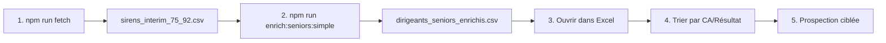

# CompanySearch - Prospection B2B Dirigeants Seniors

## 🎯 Objectif Principal

**Identifier les dirigeants seniors (62+ ans) des entreprises d'intérim de Paris et Hauts-de-Seine** pour opportunités de succession/transmission d'entreprise.

## ⚡ Utilisation Simple et Directe

### 1️⃣ Collecter les SIREN (GRATUIT)
```bash
npm run fetch
```
→ Génère `output/sirens_interim_75_92.csv`

### 2️⃣ Enrichir avec Pappers (PAYANT)
```bash
npm run enrich:seniors:simple
```
→ Génère `output/dirigeants_seniors_enrichis.csv`

## 📊 Données Collectées

Pour chaque dirigeant né avant 1962, le script récupère :
- **Société** : Nom de l'entreprise
- **SIREN** : Numéro d'identification
- **Chiffre d'affaires** : CA de l'entreprise
- **Résultat** : Bénéfice/Perte
- **Dirigeant** : Nom, prénom, fonction
- **Âge** : Année de naissance et âge actuel
- **Localisation** : Ville du siège
- **Activité** : Code NAF et effectif

## 🚀 Installation Rapide

```bash
# 1. Cloner le projet
git clone https://github.com/Bencode92/CompanySearch.git
cd CompanySearch

# 2. Installer les dépendances
npm install

# 3. Configurer la clé API Pappers
cp .env.example .env
# Éditer .env et ajouter votre clé PAPPERS_API_KEY
```

## 🤖 Automatisation GitHub Actions

### Workflow "Enrich Senior Directors Simple"

1. **Aller dans Actions** → "Enrich Senior Directors Simple"
2. **Cliquer sur "Run workflow"**
3. **Télécharger les résultats** dans les Artifacts

**Prérequis** :
- Configurer `PAPPERS_API_KEY` dans Settings → Secrets → Actions
- Le fichier `sirens_interim_75_92.csv` doit exister

### Automatisation complète

- **Vendredi 5h** : Collecte automatique des SIREN (workflow "Get SIREN List Paris-92")
- **Lundi 6h** : Enrichissement automatique des dirigeants seniors
- **Résultats** : Téléchargeables dans les artifacts ou directement dans le repo

## 📈 Exemple de Résultat

```csv
Société;SIREN;Chiffre d'affaires;Résultat;Nom dirigeant;Prénom dirigeant;Fonction;Année naissance;Âge actuel
INTERIM PLUS;123456789;5 234 000;234 000;DUPONT;Jean;Président;1960;64
TRAVAIL TEMPO;987654321;2 100 000;-50 000;MARTIN;Pierre;Gérant;1958;66
```

## 💰 Coûts Estimés

- **Collecte SIREN** : GRATUIT (API gouvernementale)
- **Enrichissement Pappers** : ~0.02€ par entreprise
- **Exemple** : 500 entreprises = ~10€

## 🎯 Cas d'Usage Business

### Succession d'entreprise
Les dirigeants de 62+ ans sont des cibles privilégiées pour :
- Transmission d'entreprise
- Rachat/Reprise
- Services de conseil en cession
- Accompagnement retraite

### Critères de ciblage
- **Âge** : 62 ans et plus (nés avant 1962)
- **Secteur** : Intérim (NAF 78.20Z)
- **Zone** : Paris (75) et Hauts-de-Seine (92)
- **Données financières** : CA et résultat disponibles

## 📝 Scripts Disponibles

| Commande | Description | Coût |
|----------|-------------|------|
| `npm run fetch` | Collecte SIREN Paris + 92 | GRATUIT |
| `npm run enrich:seniors:simple` | Enrichit dirigeants 62+ ans | PAYANT |
| `npm run estimate` | Estime le volume | GRATUIT |

## ⚠️ Notes Importantes

- **RGPD** : Respecter la réglementation sur les données personnelles
- **Limite API** : Pappers limite le nombre de requêtes/seconde
- **Vérification** : Toujours vérifier que le fichier SIREN existe avant enrichissement

## 🆘 Support

- **Problème ?** → [Ouvrir une issue](https://github.com/Bencode92/CompanySearch/issues)
- **API Pappers** → [Documentation](https://www.pappers.fr/api)
- **API Gouv** → [Documentation](https://api.gouv.fr/les-api/api-recherche-entreprises)

## 📊 Workflow Complet



## ✨ Fonctionnalités Avancées

Pour des besoins plus complexes, des scripts avancés sont disponibles :

- **Multi-départements** : Toute l'Île-de-France
- **Multi-NAF** : Plusieurs secteurs d'activité
- **Filtres avancés** : CA min/max, effectifs, villes
- **Formats multiples** : CSV, JSON, Excel

Voir `scripts/fetch_idf_advanced.js` et `scripts/enrich_pappers_advanced.js` pour plus d'options.

---

**💡 Conseil** : Commencez par un test sur 100 entreprises pour valider le processus avant de traiter l'ensemble des données.