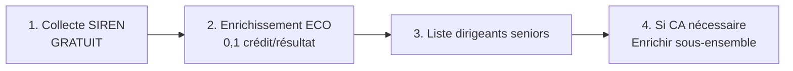

# CompanySearch - Prospection B2B Dirigeants Seniors

## 🎉 NOUVEAU : Version ULTRA-ÉCONOMIQUE !

**💰 Économisez 95% sur vos crédits Pappers** avec la nouvelle méthode `/recherche-dirigeants` :
- **0,1 crédit** par dirigeant trouvé (au lieu de 1-2 crédits/entreprise)
- **Nom société GRATUIT** via l'API gouvernementale
- **Filtre par âge intégré** dans l'API

## ⚡ Utilisation Rapide

### Version ÉCONOMIQUE (Recommandée) 💰

```bash
# 1. Collecter les SIREN (GRATUIT)
npm run fetch

# 2. Enrichir - Version ÉCO (0,1 crédit/résultat)
npm run enrich:seniors:eco
```
→ Génère `output/dirigeants_seniors_eco.csv`

### Version Classique (Si CA nécessaire)

```bash
# 1. Collecter les SIREN (GRATUIT)
npm run fetch

# 2. Enrichir - Version complète (1-2 crédits/entreprise)
npm run enrich:seniors:simple
```
→ Génère `output/dirigeants_seniors_enrichis.csv`

## 📊 Comparaison des Méthodes

| Méthode | Coût | Données | Cas d'usage |
|---------|------|---------|------------|
| **ECO** ✨ | 0,1 crédit/dirigeant | Société, SIREN, Dirigeant, Âge | Identification rapide |
| **Classique** | 1-2 crédits/entreprise | + CA, Résultat, Effectif | Analyse financière |

**Exemple sur 1300 entreprises** :
- Version ECO : ~20 crédits (~0,40€)
- Version Classique : ~1300 crédits (~26€)
- **Économie : 98% !** 🎉

## 🎯 Objectif

**Identifier les dirigeants seniors (62+ ans)** des entreprises d'intérim de Paris et Hauts-de-Seine pour :
- Opportunités de succession/transmission
- Services de conseil en cession
- Accompagnement retraite

## 📦 Installation

```bash
git clone https://github.com/Bencode92/CompanySearch.git
cd CompanySearch
npm install

# Configurer la clé API Pappers
cp .env.example .env
# Éditer .env et ajouter PAPPERS_API_KEY
```

## 🤖 GitHub Actions

### 3 Workflows disponibles :

1. **"Get SIREN List Paris-92"** (GRATUIT)
   - Collecte automatique tous les vendredis
   - Génère `sirens_interim_75_92.csv`

2. **"Enrich Senior Directors ECO"** (ÉCONOMIQUE)
   - 0,1 crédit par dirigeant trouvé
   - Idéal pour identification rapide

3. **"Enrich Senior Directors Simple"** (COMPLET)
   - Inclut CA et résultat
   - Pour analyse financière approfondie

## 📈 Workflow Recommandé



## 📊 Données Collectées

### Version ECO
- Société (nom)
- SIREN / SIRET siège
- Dirigeant (nom, prénom, fonction)
- Date de naissance et âge
- Ville du siège

### Version Classique
- Tout ce qui précède +
- Chiffre d'affaires
- Résultat
- Effectif
- Code NAF

## 💡 Conseils d'Optimisation

1. **Toujours commencer par la version ECO** pour identifier les cibles
2. **Enrichir avec CA** uniquement sur les entreprises pertinentes
3. **Tester sur 100 SIREN** avant le traitement complet
4. **Ajuster l'année cutoff** selon vos besoins (défaut: 1962)

## 📝 Scripts Disponibles

| Commande | Description | Coût |
|----------|-------------|------|
| `npm run fetch` | Collecte SIREN Paris + 92 | GRATUIT |
| `npm run enrich:seniors:eco` | **Version ÉCO** - 62+ ans | 0,1 crédit/résultat |
| `npm run enrich:seniors:simple` | Version complète - 62+ ans | 1-2 crédits/entreprise |
| `npm run estimate` | Estime le volume | GRATUIT |

## 📁 Structure des Fichiers

```
output/
├── sirens_interim_75_92.csv     # SIREN collectés (étape 1)
├── dirigeants_seniors_eco.csv   # Version ECO (étape 2)
└── dirigeants_seniors_enrichis.csv # Version complète
```

## 💰 Estimation des Coûts

Pour ~1300 entreprises d'intérim (Paris + 92) :

| Méthode | Crédits | Coût estimé | Économie |
|---------|---------|-------------|----------|
| ECO | ~20 | ~0,40€ | 98% |
| Classique | ~1300 | ~26€ | 0% |

## 🔗 Ressources

- [Comparaison détaillée ECO vs Classique](COMPARAISON_ECO.md)
- [Guide rapide dirigeants seniors](GUIDE_SENIORS.md)
- [API Pappers](https://www.pappers.fr/api)
- [API Gouvernementale](https://api.gouv.fr/les-api/api-recherche-entreprises)

## ⚠️ Important

- **RGPD** : Respecter la réglementation sur les données personnelles
- **Clé API** : Nécessaire pour Pappers (payant)
- **Rate Limiting** : Les scripts gèrent automatiquement les limites

## 🆘 Support

Problème ? → [Ouvrir une issue](https://github.com/Bencode92/CompanySearch/issues)

---

**💡 Astuce** : La version ECO utilise `/recherche-dirigeants` qui ne facture que les résultats retournés. Parfait pour cibler uniquement les dirigeants seniors sans payer pour les entreprises sans dirigeants éligibles !